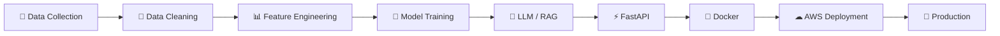
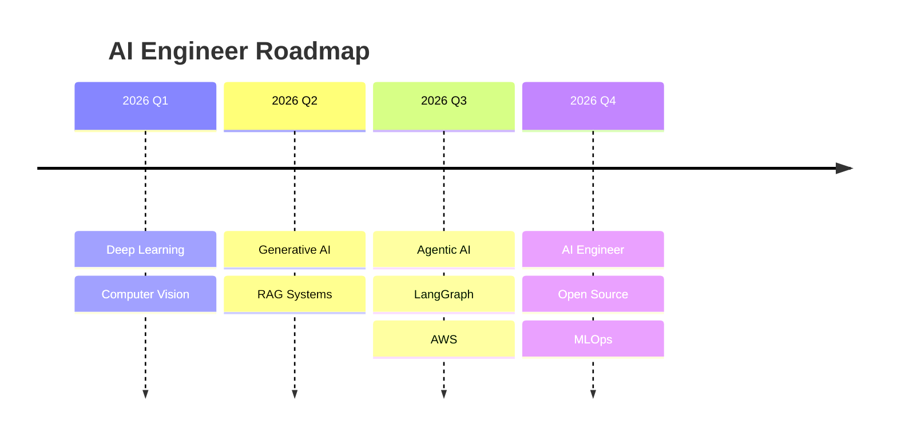

<div align="center">


<br>


<br><br>

<a href="mailto:manojroyal200347@gmail.com">

</a>

<a href="https://linkedin.com/in/manoj-royal">

</a>

<a href="https://github.com/manojroyal422">

</a>

<br><br>


</div>

---

# 👋 Hello, I'm Manoj Royal

I'm an **AI Engineer** passionate about building **real-world intelligent systems** powered by **Machine Learning**, **Large Language Models**, **Computer Vision**, and **Generative AI**.

Instead of building notebook-only projects, I enjoy designing **production-ready AI applications** using scalable architectures, modern frameworks, and cloud-native deployment practices.

Currently exploring:

- 🤖 Large Language Models (LLMs)
- 🧠 Retrieval-Augmented Generation (RAG)
- ⚡ Agentic AI Systems
- 🚀 MLOps & AI Deployment
- ☁️ AWS Cloud
- 🐳 Docker & FastAPI

---

## 💡 What I Do

✔ Build AI-powered web applications

✔ Design Retrieval-Augmented Generation (RAG) pipelines

✔ Develop Computer Vision systems

✔ Train Deep Learning models

✔ Deploy scalable AI APIs

✔ Build production-ready FastAPI applications

✔ Optimize ML inference performance

✔ Continuously learn emerging AI technologies

---# 🚀 About Me


🎓 **B.Tech in Computer Science Engineering (AI & ML)**

💼 Passionate about building intelligent applications powered by Artificial Intelligence.

🧠 Interested in solving real-world problems using:

- Large Language Models (LLMs)
- Machine Learning
- Deep Learning
- Computer Vision
- Natural Language Processing
- Retrieval-Augmented Generation (RAG)

🌱 Currently learning

- Agentic AI
- LangGraph
- MLOps
- AWS Cloud
- AI Deployment
- Scalable AI Systems

💬 Ask me about

```text
Python
Machine Learning
Deep Learning
PyTorch
TensorFlow
FastAPI
Computer Vision
RAG
LangChain
Docker
```

---

# ⚡ Quick Facts

<table>

<tr>

<td>💻 Languages</td>
<td>Python • SQL</td>

</tr>

<tr>

<td>🤖 AI</td>
<td>Machine Learning • Deep Learning • NLP • Computer Vision</td>

</tr>

<tr>

<td>🧠 GenAI</td>

<td>LLMs • LangChain • RAG • Hugging Face • FAISS</td>

</tr>

<tr>

<td>⚙ Backend</td>

<td>FastAPI • Flask</td>

</tr>

<tr>

<td>☁ Cloud</td>

<td>AWS</td>

</tr>

<tr>

<td>🐳 DevOps</td>

<td>Docker • Git • GitHub</td>

</tr>

</table>

---

# 💻 Tech Stack

## 👨‍💻 Programming

<p>


</p>

---

## 🤖 Machine Learning

<p>


</p>

---

## 🧠 Generative AI

<p>


</p>

---

## ⚙ Backend Development

<p>


</p>

---

## ☁ Cloud & DevOps

<p>


</p>

---

# 🏗 AI Development Workflow



---

# 🎯 Core Competencies

<table>

<tr>

<td>✔ Machine Learning</td>

<td>✔ Deep Learning</td>

<td>✔ NLP</td>

</tr>

<tr>

<td>✔ Computer Vision</td>

<td>✔ Generative AI</td>

<td>✔ Prompt Engineering</td>

</tr>

<tr>

<td>✔ RAG Pipelines</td>

<td>✔ REST APIs</td>

<td>✔ FastAPI</td>

</tr>

<tr>

<td>✔ Docker</td>

<td>✔ AWS</td>

<td>✔ Git</td>

</tr>

</table>

---

# 🌱 Currently Learning

```yaml
learning:

  - Agentic AI

  - LangGraph

  - MLOps

  - AI Deployment

  - AWS Cloud

  - Scalable AI Systems

  - Vector Databases

  - LLM Fine-Tuning
```

---# 🚀 Featured Projects

<p align="center">

<i>Building AI solutions that solve real-world problems.</i>

</p>

---

<table>

<tr>

<td width="50%" valign="top">

## 🧠 AI Knowledge Assistant


### 📌 Overview

A production-ready Retrieval-Augmented Generation (RAG) chatbot designed to answer domain-specific questions using semantic search and Large Language Models.

### ⚙ Tech Stack

Python • LangChain • FAISS • Hugging Face • FastAPI

### ✨ Highlights

- 🔍 Semantic search using dense vector embeddings
- 🤖 Retrieval-Augmented Generation pipeline
- ⚡ Less than 2-second response latency
- 🌐 REST API with FastAPI
- 📦 Modular architecture for easy scaling

### 📊 Metrics

| Metric | Result |
|---------|--------|
| Response Time | <2 sec |
| Architecture | RAG |
| API | FastAPI |

### 🔗 Links

<a href="https://github.com/manojroyal422/ai-knowledge-assistant">

</a>

</td>

<td width="50%" valign="top">

## 🧬 Brain Tumor Segmentation


### 📌 Overview

Deep learning application for automatic MRI brain tumor segmentation using a 3D U-Net architecture.

### ⚙ Tech Stack

Python • PyTorch • Flask • OpenCV

### ✨ Highlights

- 🧠 3D U-Net architecture
- 🏥 BraTS MRI dataset
- 🖼️ 10K+ processed MRI slices
- 📈 Dice Score of 94%
- 🌐 Flask web application

### 📊 Metrics

| Metric | Result |
|---------|--------|
| Dice Score | 94% |
| Images | 10K+ |
| Model | 3D U-Net |

### 🔗 Links

<a href="https://github.com/manojroyal422/brain-tumor-segmentation">

</a>

</td>

</tr>

<tr>

<td width="50%" valign="top">

## 🦺 Factory Guard AI


### 📌 Overview

Computer Vision solution that detects safety helmets and reflective vests in real time using YOLOv8.

### ⚙ Tech Stack

Python • YOLOv8 • OpenCV

### ✨ Highlights

- 🎥 Real-time PPE detection
- 👷 Helmet & vest recognition
- ⚡ 30 FPS CPU inference
- 📷 Live webcam support
- 📉 Optimized preprocessing pipeline

### 📊 Metrics

| Metric | Result |
|---------|--------|
| FPS | 30 |
| Detection | Real-Time |
| Framework | YOLOv8 |

### 🔗 Links

<a href="https://github.com/manojroyal422/factory-guard-ai">

</a>

</td>

<td width="50%" valign="top">

## 📈 Stock Prediction API


### 📌 Overview

Hybrid stock forecasting system using deep learning and ensemble learning techniques.

### ⚙ Tech Stack

Python • LSTM • Random Forest • FastAPI • Docker

### ✨ Highlights

- 📈 Time-series forecasting
- 🤖 Hybrid ML model
- 📦 Dockerized deployment
- ⚡ REST API
- 📊 Feature engineering

### 📊 Metrics

| Metric | Result |
|---------|--------|
| Accuracy Improvement | +18% |
| Deployment | Docker |
| API | FastAPI |

### 🔗 Links

<a href="https://github.com/manojroyal422/stock-prediction-api">

</a>

</td>

</tr>

</table>

---

# ⭐ Featured Repositories

<p align="center">

<a href="https://github.com/manojroyal422">


</a>

<a href="https://github.com/manojroyal422">


</a>

</p>

<p align="center">

<a href="https://github.com/manojroyal422">


</a>

<a href="https://github.com/manojroyal422">


</a>

</p>

---

# 📈 Impact

<table>

<tr>

<td align="center">

## 🤖

### AI Projects

**4+**

</td>

<td align="center">

## 📚

### Models Built

**10+**

</td>

<td align="center">

## 🚀

### APIs Developed

**5+**

</td>

<td align="center">

## ⚡

### AI Technologies

**15+**

</td>

</tr>

</table>

---# 📊 GitHub Analytics

<p align="center">


</p>

<p align="center">


</p>

---

# 🏆 GitHub Trophies

<p align="center">


</p>

---

# 📈 Contribution Activity

<p align="center">


</p>

---

# 🐍 Contribution Snake

<p align="center">


</p>

---

# ⚡ Development Activity

<p align="center">


</p>

<p align="center">


</p>

<p align="center">


</p>

---

# 💻 Coding Profiles

<p align="center">

<a href="https://leetcode.com/">

</a>

<a href="https://www.hackerrank.com/">

</a>

<a href="https://www.kaggle.com/">

</a>

<a href="https://tryhackme.com/">

</a>

</p>

> Replace the links above with your own profile URLs.

---

# 📚 Learning Progress

```text
███████████████████░░ 90%  Python

█████████████████░░░░ 85%  Machine Learning

████████████████░░░░░ 80%  Deep Learning

███████████████░░░░░░ 75%  Generative AI

██████████████░░░░░░░ 70%  Computer Vision

█████████████░░░░░░░░ 65%  MLOps

████████████░░░░░░░░░ 60%  AWS

███████████░░░░░░░░░░ 55%  Agentic AI
```

---

# 🌍 Open Source Goals

- ✅ Build reusable AI/ML applications
- 🤝 Contribute to open-source AI libraries
- 📚 Share practical learning resources
- 🚀 Publish production-ready AI projects
- 🌟 Collaborate on innovative AI solutions

---

# 📌 2026 Goals

- 🎯 Land an AI/ML Engineer role
- 🚀 Build 10 production-ready AI projects
- 🤖 Master Agentic AI and LangGraph
- ☁️ Deploy scalable AI systems on AWS
- 📚 Contribute consistently to open source
- ⭐ Reach 500+ GitHub contributions
- 🏆 Earn AWS and AI certifications

------

# 🏆 Certifications & Learning

<div align="center">

| 🎓 Certification | Status |
|-----------------|--------|
| Machine Learning | ✅ Completed |
| Deep Learning | ✅ Completed |
| Python Programming | ✅ Completed |
| Generative AI Fundamentals | 🚀 In Progress |
| AWS Cloud Practitioner | 📚 Planned |
| Docker Essentials | 📚 Planned |

</div>

---

# 🎯 Career Focus

<div align="center">

```text
AI Engineering
━━━━━━━━━━━━━━━━━━━━━━━━━━━━━━━ 100%

Machine Learning
━━━━━━━━━━━━━━━━━━━━━━━━━━━━━━━ 95%

Deep Learning
━━━━━━━━━━━━━━━━━━━━━━━━━━━━━━━ 90%

Computer Vision
━━━━━━━━━━━━━━━━━━━━━━━━━━━━━━━ 88%

Generative AI
━━━━━━━━━━━━━━━━━━━━━━━━━━━━━━━ 85%

MLOps
━━━━━━━━━━━━━━━━━━━━━━━ 70%

AWS Cloud
━━━━━━━━━━━━━━━━━━━━━━ 65%
```

</div>

---

# 🌟 Achievements

<div align="center">

| 🚀 Achievement | Details |
|---------------|---------|
| 🤖 AI Projects | Built multiple AI/ML applications |
| 🧠 Deep Learning | Developed CNN, LSTM & 3D U-Net models |
| 💬 NLP | Built Retrieval-Augmented Generation (RAG) systems |
| 👁️ Computer Vision | Real-time object detection and medical imaging |
| 🌐 APIs | Developed AI-powered REST APIs with FastAPI & Flask |
| 🐳 Deployment | Containerized applications using Docker |
| 📈 Continuous Learning | Exploring Agentic AI, LangGraph & MLOps |

</div>

---

# 📅 2026 Roadmap



---

# 🤝 Let's Connect

<div align="center">

<a href="mailto:manojroyal200347@gmail.com">

</a>

<a href="https://linkedin.com/in/manoj-royal">

</a>

<a href="https://github.com/manojroyal422">

</a>

<a href="https://www.kaggle.com/">

</a>

<a href="https://leetcode.com/">

</a>

</div>

---

# 💬 Quote

<div align="center">

> **"The best way to predict the future is to build it."**

*"Artificial Intelligence isn't about replacing people—it's about empowering them to solve bigger problems."*

</div>

---

# ⚡ Fun Fact

```python
class AIEngineer:

    def __init__(self):

        self.name = "Manoj Royal"

        self.role = "AI Engineer"

        self.skills = [
            "Python",
            "Machine Learning",
            "Deep Learning",
            "Generative AI",
            "Computer Vision",
            "FastAPI",
            "Docker"
        ]

    def daily_routine(self):

        while True:

            self.learn()

            self.build()

            self.deploy()

            self.improve()

            self.repeat()
```

---

# 🌍 Visitor Counter

<div align="center">


</div>

---

# 💙 Support My Work

<div align="center">

⭐ If you find my projects useful, consider giving them a star.

🤝 I'm always open to collaborating on AI, Machine Learning, and Generative AI projects.

🚀 Let's build something impactful together!

</div>

---

<div align="center">


## 🚀 Thanks for Visiting!

### Happy Coding! 👨‍💻


</div>
